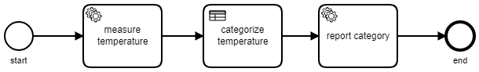
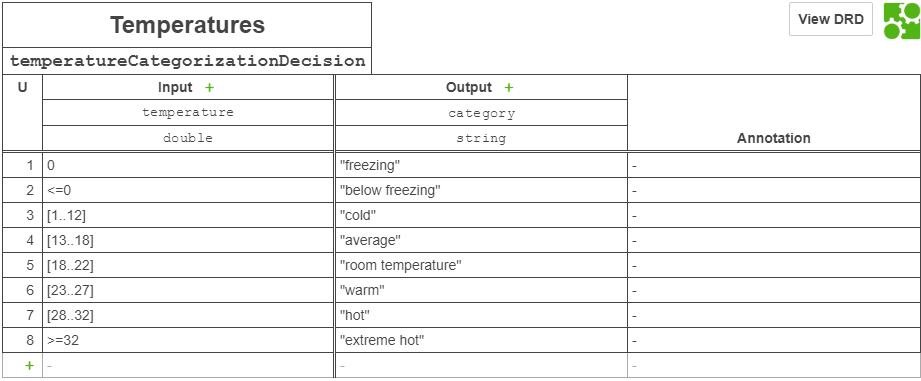
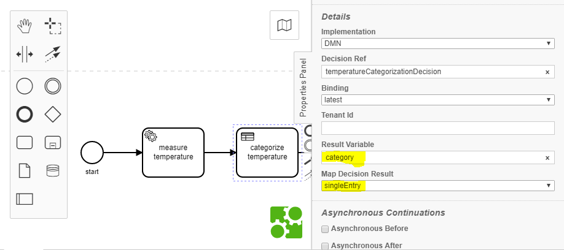

# Basic DMN Camunda Process Example

If you are not familiar in running a sample, please head over to the [quiz sample](../quiz/readme.md), which shows more detailed steps on how to get stuff running.

## About this sample

This code sample shows the interaction of two Extneral Task Workers in C# that interact with a very simple decision table. This is outlined in the following diagram:



## Step1: The first worker

The first worker will get the current temperature from a sensor input in the measureTemperature topic subscription form this bpmn:

```csharp
    [ExternalTaskTopic("measureTemperature")]
    public class MeasureTemperature : IExternalTaskAdapter
    {
        public void Execute(ExternalTask externalTask, ref Dictionary<string, object> resultVariables)
        {
            // Get Sensor data, hypothetically.
            var temperature = new Random().Next( -5, 40);
            Console.WriteLine($"Measured temperature: {temperature}");
            resultVariables.Add("temperature",temperature);
        }
    }
```

## Step 2: The DMN decision table 

After the worker sends back its information to the BPM engine, it will then be fed into the DMN decision table step called: "categorize temperature".



The input correlates to the result variable set by the previous worker (a random number between -5 to 40)
the output category is set and bound to the bpmn by setting the appropiate property on the DMN shape's properties:



## Step 3: The Second Worker

The second worker will get the temperature category from the dmn decision table and reports it to the console.

```csharp
    [ExternalTaskTopic("reportCategory")]
    public class ReportCategory : IExternalTaskAdapter
    {
        public void Execute(ExternalTask externalTask, ref Dictionary<string, object> resultVariables)
        {
            Console.WriteLine($"Categorized temperature: {externalTask.Variables["category"].Value}");
        }
    }
```
## Running the dmn sample

Below you will find the output when running this task from the camunda user interface.

```pre
 __      __.___  ________________     _____ .______________ 
/  \    /  |   |/  _____/\_____  \   /  |  ||   \__    ___/ 
\   \/\/   |   /   \  ___ /   |   \ /   |  ||   | |    |    
 \        /|   \    \_\  /    |    /    ^   |   | |    |    
  \__/\  / |___|\______  \_______  \____   ||___| |____|    
       \/              \/        \/     |__|                
       
basic-dmn camunda processes
Deploying models and start External Task Workers.

PRESS Ctrl-C TO STOP WORKERS.

Register Task Worker for Topic 'measureTemperature'
Register Task Worker for Topic 'reportCategory'

Adding resource to deployment: basic-dmn.resources.temperature.bpmn
Adding resource to deployment: basic-dmn.resources.temperatureCategorizationDecision.dmn

Deployment to Camunda BPM succeeded.

Execute External Task from topic 'measureTemperature': ExternalTask [Id=6ecc6e0a-a3d6-11e8-916d-0242ac110002, ActivityId=Task_1cngefl]...
Measured temperature: 5
...finished External Task 6ecc6e0a-a3d6-11e8-916d-0242ac110002
Execute External Task from topic 'reportCategory': ExternalTask [Id=6ee5c278-a3d6-11e8-916d-0242ac110002, ActivityId=Task_0jr1bh9]...
Categorized temperature: cold
...finished External Task 6ee5c278-a3d6-11e8-916d-0242ac110002
```