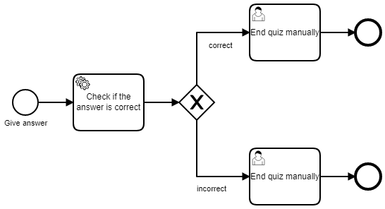
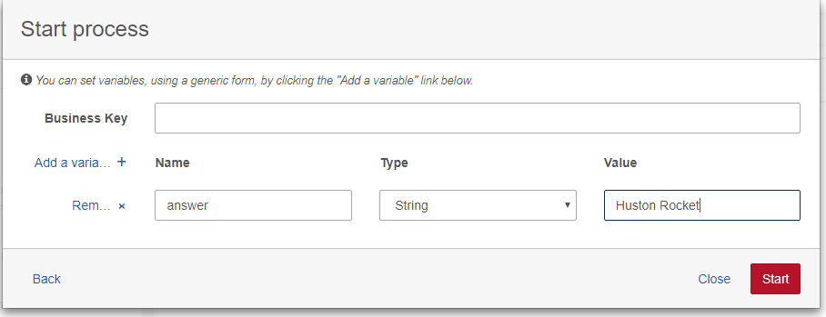
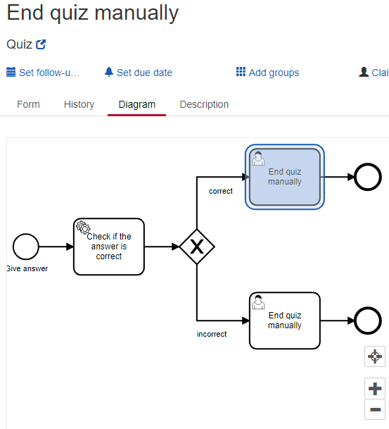

# Quiz example

## About this sample

The quiz example exposes a simple BPMN decision process which requests an external REST-API to pull in quiz data and then checks the answer in the json data using an external task written in c#.

The javascript returns the boolean true/false based on a regex search pattern in the data.

### Running the sample

```
dotnet run

 __      __.___  ________________     _____ .______________
/  \    /  |   |/  _____/\_____  \   /  |  ||   \__    ___/
\   \/\/   |   /   \  ___ /   |   \ /   |  ||   | |    |
 \        /|   \    \_\  /    |    /    ^   |   | |    |
  \__/\  / |___|\______  \_______  \____   ||___| |____|
       \/              \/        \/     |__|

quiz camunda processes

Deploying models and start External Task Workers.

PRESS Ctrl-C TO STOP WORKERS.


Adding resource to deployment: quiz.resources.parseAnswer.js
Adding resource to deployment: quiz.resources.quiz.bpmn
Deployment to Camunda BPM succeeded.
```
### Start the process

1. In the camunda cockpit go to processs. Login u/l: demo/demo  
http://localhost:8080/camunda/app/cockpit/default/#/processes
2. Select the 'Quiz' process
3. The following bpmn diagram is shown



4. Go to the tasks screen  http://localhost:8080/camunda/app/tasklist/default/#/
5. Click on start process
6. Click on the quiz process
7. As we have no form deployed, camunda allows for setting the variables manually
8. Click on the plus sign
9. Add a property with the name answer of type string



10. Enter either the correct or incorrect answer as specifid in the answer json file shown here:
```json
{
    "quiz": {
        "sport": {
            "q1": {
                "question": "Which one is correct team name in NBA?",
                "options": [
                    "New York Bulls",
                    "Los Angeles Kings",
                    "Golden State Warriros",
                    "Huston Rocket"
                ],
                "answer": "Huston Rocket"
            }
        }
    }
}
```
11. Execute the task.

12. The engine will execute the external task ParseAnswer (C#)

```csharp
    class PaserAnswer : IExternalTaskAdapter
    {
        public void Execute(ExternalTask externalTask, ref Dictionary<string, object> resultVariables)
        {
            Console.WriteLine("--- Result variables ---");
            foreach (var item in externalTask.Variables) {
                Console.WriteLine(item.Key.ToString().PadRight(18) + ": " + item.Value.Value.ToString() );
            }
            
            foreach (var item in resultVariables){
                Console.WriteLine(item.Key.ToString());
            }
            Console.WriteLine("------------------------");
            JObject quiz = JObject.Parse(File.ReadAllText(@"..\rest\simple-response.json"));
            var expected =  (string)quiz["quiz"]["sport"]["q1"]["answer"];
            Console.WriteLine("Expected answer:  " + expected);
            var result = string.Equals(expected, externalTask.Variables["answer"].Value);
            Console.WriteLine("correct?          : " + result);
            resultVariables.Add("correct", result);
        }
    }
```
```pre
Execute External Task from topic 'parseanswer': ExternalTask [Id=bd5db4c7-a223-11e8-b75c-0242ac110002, ActivityId=ServiceTask_1]...
--- Result variables ---
answer            : Huston Rocket
------------------------
Expected answer:  Huston Rocket
correct?          : True
...finished External Task bd5db4c7-a223-11e8-b75c-0242ac110002
```

13. You can now select the task from the tasklist in camunda and claim it in order to finalize the answer.

